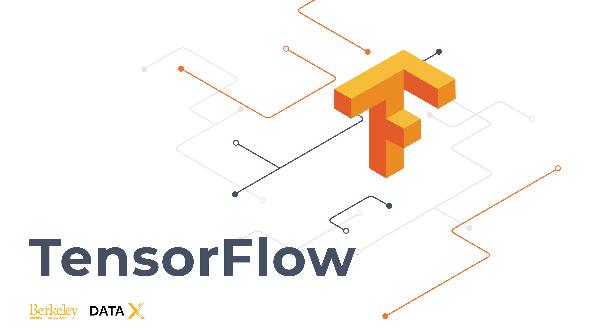
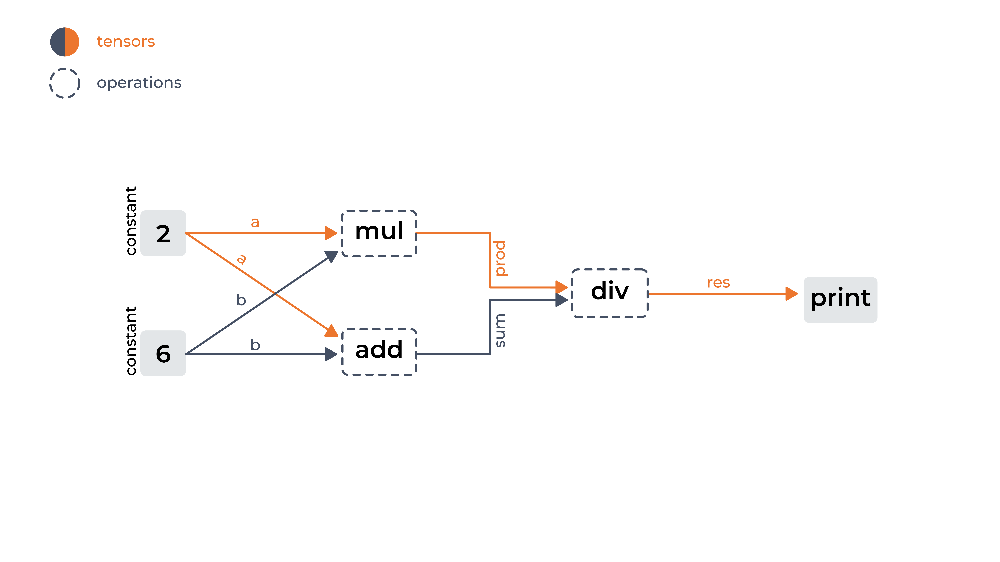

     
     
# **DATA-X:**    m420 - BREAD &amp; BUTTER DEEP LEARNING - REGRESSION AND CLASSIFICATION USING TENSORFLOW v2 AND LUDWIG

 

 

**Author List (in no particular order):** [Elias Castro Hernandez](https://www.linkedin.com/in/ehcastroh/), [Ikhlaq Sidhu](https://ikhlaq-sidhu.com/), and [Debbie Yuen](http://www.debbiecyuen.me/). 

**About (TL/DR):** Tensorflow (TF) is an open-source library used for dataflow, differentiable programming, symbolic math, and machine learning applications such as deep learning neural networks. [Ludwig](https://ludwig-ai.github.io/ludwig-docs/index.html) is a toolbox built atop TF that enables users the ability to train and test deep learning models without the need to write code.

**Learning Goal(s):** This notebook covers advanced topics in machine learning. However, it does not require any prior knowledge in machine learning. The goal of this notebook is to teach a user how to deploy deep learning regression and classification models, using structured data. This task is so common to machine learning, that it is pretty much the bread and butter of ML engineers. 

**Associated Materials:** To ease the learning curve, we encourage the user of this notebook to visit the [Data-X](https://datax.berkeley.edu/) site for resources on fundamentals of machine learning, and an introductoin to TensorFlow v2.

**Keywords (Tags):** tensorflow, tensor-flow, tensorflow-tutorial, deep-learning, deep-learning-with-python, neural-networks, Ludwig, deep-learning-toolbox, data-x, uc-berkeley-engineering 

**Prerequisite Knowledge:** (1) Python, (2) Pandas, (3) Matplotlib, (4) TensorFlow v2 

**Target User:** Data scientists, applied machine learning engineers, and developers

**Copyright:** Content curation has been used to expedite the creation of the following learning materials. Credit and copyright belong to the content creators used in facilitating this content. Please support the creators of the resources used by frequenting their sites, and social media.

     
### **CONTENT**   

  - m420_dl_bread_and_butter_regression_classification_TF_LUDWIG -- Regression and classification with TFv2 and Ludwig.
  - assets/homeworks/   -- Contains several exercises to help you master the material.

#### **I. LINEAR REGRESSION**

     
    1) PART 3.1: PROBLEM DEFINITION AND SETUP
    2) PART 3.2: MODEL
    3) PART 3.3: GENERALIZATION AND PREDICTIONS  
    
#### **II. IMAGE CLASSIFICATION**

     
    1) PART 2.1: TO DO

  
    
#### **III. WRAP UP AND NEXT STEPS**

You've completed the introduction to TensorFlow V.2, and one can assume that you are ready to get things done with your new knowledge. Visit the [**Data-X website**](https://datax.berkeley.edu/) to learn how to use TensorFlow to tackle various deep learning problems, or use the following links to some topics of interest:

> [TODO (m--): url needed]() TODO TODO TODO.

> [TODO (m--): url needed]() TODO TODO TODO.

> [TODO (m--): url needed]() TODO TODO TODO.

# reg_clas_TF_LUDWIG
